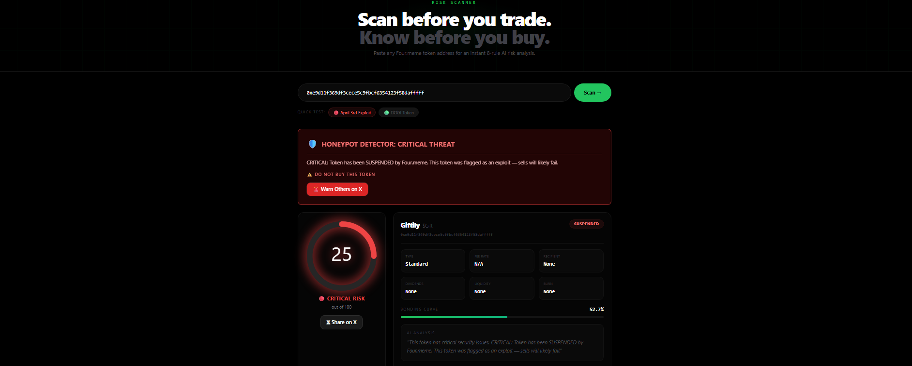
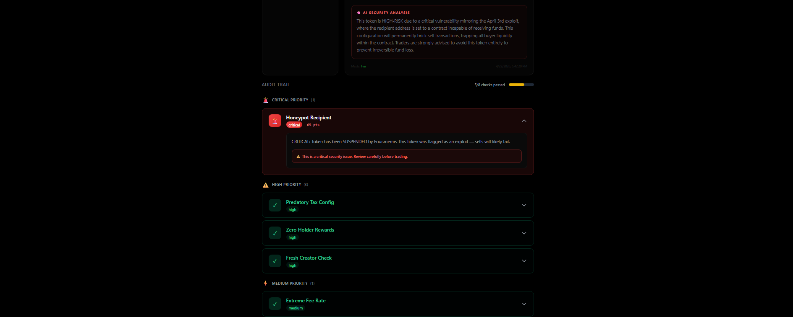
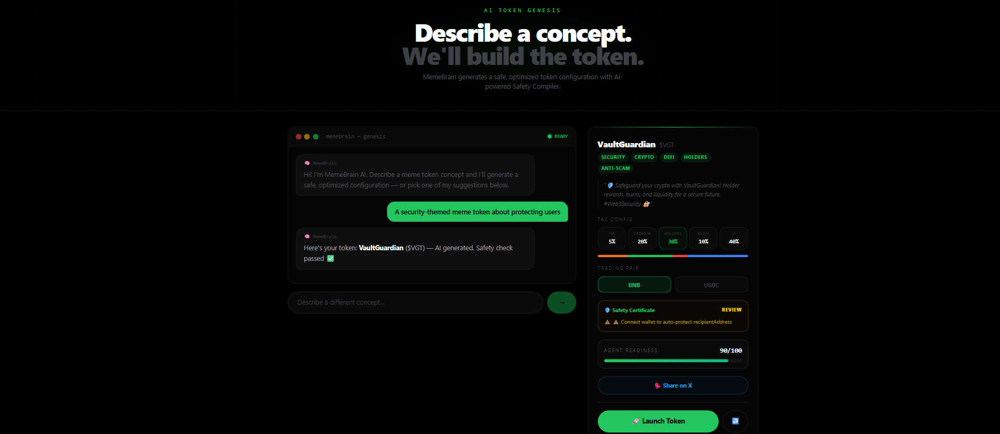
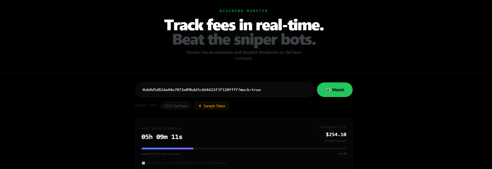
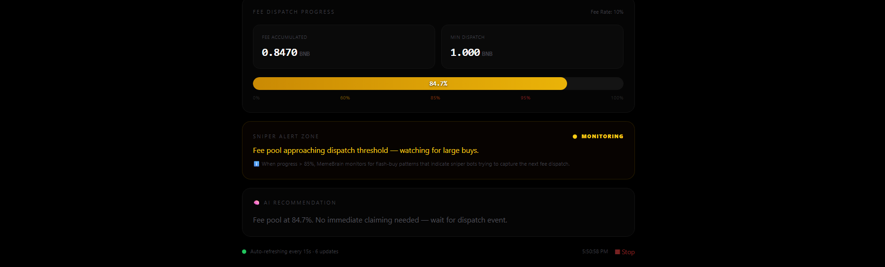

# 🧠 MemeBrain

> **Four.meme gave AI the hands. We built the brain.**

MemeBrain is an autonomous AI safety layer for [Four.meme](https://four.meme) on BNB Chain. It protects traders from exploits in real-time, helps creators launch safer tokens, and monitors dividend distributions for sniper bot activity.

## 🔗 Links

| | |
|---|---|
| **Live Demo** | https://69e6c731f833eb2ce144f77c--poetic-stardust-ee10e4.netlify.app/ |
| **Demo Video** | https://www.youtube.com/watch?v=kgOrpAsStZU |

---

## Screenshots

### Risk Scanner
| Overview | Audit Trail |
|:---:|:---:|
|  |  |
| Honeypot detected — CRITICAL score (25/100) | 8-rule audit trail with severity tiers |

### Token Genesis
| Token Genesis |
|:---:|
|  |
| AI generates safe token configs with Safety Certificate |

### Dividend Monitor
| Overview | Fee Progress + Sniper Alert |
|:---:|:---:|
|  |  |
| Auto-dispatch countdown + live data | 84.7% progress — sniper alert zone active |
---

## The Problem

On April 3rd 2025, a misconfigured TaxToken on Four.meme set its `recipientAddress` to a contract that couldn't receive WBNB. Result: **users could buy, but every sell transaction reverted** — a honeypot. Four.meme had to manually refund 9 transactions and suspend TaxToken creation.

Four.meme's AI skill gives agents the ability to create and trade tokens, but provides **zero safety intelligence** — no risk analysis, no exploit detection, no autonomous decision-making.

## The Solution

MemeBrain adds an AI-powered intelligence layer on top of Four.meme:

### 🔍 Risk Scanner (`/scan`)
- **8-rule Risk Engine** that reads on-chain contract state directly from BSC
- Detects honeypots, predatory tax setups, and dividend snipers in **under 1 second**
- AI-generated risk summary with actionable audit trail
- The April 3rd exploit token scores **CRITICAL (12/100)** — Rule 1 flags the flawed `recipientAddress` instantly

### ✨ AI Token Genesis (`/genesis`)
- Conversational AI — describe your meme concept, get an optimized token config
- **Safety Compiler** auto-corrects dangerous parameters before deployment (caps founder rates, enforces anti-sniper, guarantees holder rewards)
- **Safety Certificate** — visual display of every auto-correction applied
- **Agent Readiness Score** (0–100) — rates how suitable a token config is for autonomous AI agent trading
- Trading pair selection: **BNB or USDC** (Four.meme multi-token support)
- Deploys directly through the **Four.meme API** — real contract addresses returned
- `.four` domain display for Space ID verified creators

### 📊 Dividend Monitor (`/monitor`)
- Real-time fee accumulation tracking for TaxTokens
- **Sniper Alert Zone** — detects when bots are likely to flash-buy before dividend dispatch
- **Auto-dispatch countdown** — live timer to next midnight UTC+8 distribution
- **Post-graduation monitoring** — continues tracking after PancakeSwap migration
- WBNB Tax Model upgrade awareness (tokens after block 90507362)

---

## Risk Engine — 8 Rules

| # | Rule | What It Detects |
|---|------|-----------------|
| 1 | `recipientAddress` bytecode check | Honeypot — recipient contract can't receive WBNB |
| 2 | `recipientRate` cap (≤30%) | Predatory founder allocation |
| 3 | `feeRate` cap (≤10%) | Excessive trading tax |
| 4 | `feePlan` enforcement | Missing anti-sniper protection |
| 5 | `divideRate` minimum | Insufficient holder rewards |
| 6 | Token status check | Suspended/flagged tokens |
| 7 | Bonding curve progress | Liquidity and graduation risk |
| 8 | Combined risk score | Aggregate safety assessment |

---

## Tech Stack

| Layer | Technology |
|-------|-----------|
| Framework | Next.js 14 (App Router) |
| Language | TypeScript |
| Styling | Tailwind CSS |
| Blockchain | ethers.js, wagmi, RainbowKit |
| AI/LLM | Blink API (Claude-based) |
| API Integration | Four.meme REST API (create, upload, auth) |
| Chain | BNB Smart Chain (Mainnet) |

---

## Architecture

```
┌─────────────────────────────────────────────────┐
│                   Frontend                       │
│  Landing ─ Scan ─ Genesis ─ Monitor              │
│  (Next.js 14 + Tailwind + wagmi/RainbowKit)     │
└──────────────────────┬──────────────────────────┘
                       │
┌──────────────────────┴──────────────────────────┐
│                  API Routes                      │
│  /api/risk/scan    → Risk Engine + LLM Summary   │
│  /api/genesis/*    → Token Gen + Four.meme API   │
│  /api/monitor/*    → Dividend Tracking           │
│  /api/auth/*       → Four.meme Auth Proxy        │
└──────────────────────┬──────────────────────────┘
                       │
┌──────────────────────┴──────────────────────────┐
│              External Services                   │
│  BSC RPC (on-chain reads)                        │
│  Four.meme API (token create/upload/auth)        │
│  Blink API (LLM risk analysis)                   │
└─────────────────────────────────────────────────┘
```

---

## Local Development

### Prerequisites
- Node.js 18+
- npm or yarn
- MetaMask or compatible wallet

### Setup

```bash
# Clone the repo
git clone https://github.com/KamiliaNHayati/memebrain.git
cd memebrain

# Install dependencies
npm install

# Create environment file
cp .env.example .env.local
```

### Environment Variables

```env
# Required — LLM for token generation + risk narration
BLINK_API_KEY=your_blink_api_key

# Optional — override mock mode globally
NEXT_PUBLIC_APP_MODE=live  # or "mock"

# WalletConnect (RainbowKit)
NEXT_PUBLIC_WALLETCONNECT_PROJECT_ID=your_project_id
```

> You can also use `?mock=true` as a URL param to force mock mode per-page without setting env vars.

### Run

```bash
npm run dev
```

Open [http://localhost:3000](http://localhost:3000).

### Build

```bash
npm run build
```

---

## Quick Test for Judges

**Test the April 3rd exploit detection on `/scan`:**
```
0xe9d11f369df3cece5c9fbcf6354123f58dafffff
```
Expected result: CRITICAL score, Rule 1 triggered — `recipientAddress` has bytecode.

**Demo modes via URL params:**

| URL | What it does |
|-----|-------------|
| `/scan?mock=true` | Pre-loaded CRITICAL result (no API call needed) |
| `/genesis?demo=dangerous` | Triggers Safety Compiler — shows auto-corrections from dangerous config |
| `/monitor?mock=true` | Pre-loaded monitor at 84.7% progress |

---

## What's Real vs Demo Mode

| Feature | Live | Mock (`?mock=true`) |
|---------|------|------|
| Risk Scanner — on-chain reads | ✅ BSC mainnet | ✅ BSC mainnet |
| April 3rd exploit detection | ✅ Real contract | ✅ Real contract |
| AI token generation (LLM) | ✅ Live | ✅ Live |
| Safety Compiler corrections | ✅ Live | ✅ Live |
| Safety Certificate UI | ✅ Live | ✅ Live |
| Agent Readiness Score | ✅ Live | ✅ Live |
| Trading pair (BNB/USDC) | ✅ Real API | 🔶 Simulated |
| Four.meme API — token creation | ✅ Real API | 🔶 Simulated response |
| On-chain wallet TX (~0.005 BNB) | ✅ Real TX | 🔶 Skipped |
| Dividend Monitor | ✅ Live BSC data | ✅ Live BSC data |
| Auto-dispatch countdown | ✅ Real UTC+8 timer | ✅ Real UTC+8 timer |
| Post-graduation monitoring | ✅ Live | ✅ Live |

---

## Team

**Kamilia N. Hayati** — Solo builder

---

## License

MIT
